# CS2303-System-Programming

## List of programs
1. Gregorian Calendar Printer
2. Game of Life
3. String Library Functions Implementation
4. Employee Struct Implementation
5. Predator-prey simulation
6. Event-driven simulation

## Demos

## Gregorian Calendar Printer
### Description
This CLI (Command Line Interface) program will display a twelve month calendar for an arbitrary year after year 1582.

[Learn More](https://github.com/tdn90/CS2303-System-Programming/tree/master/assignment1)

### Sample output 
|                |                 |                 |
|:--------------:|:---------------:|:---------------:|
|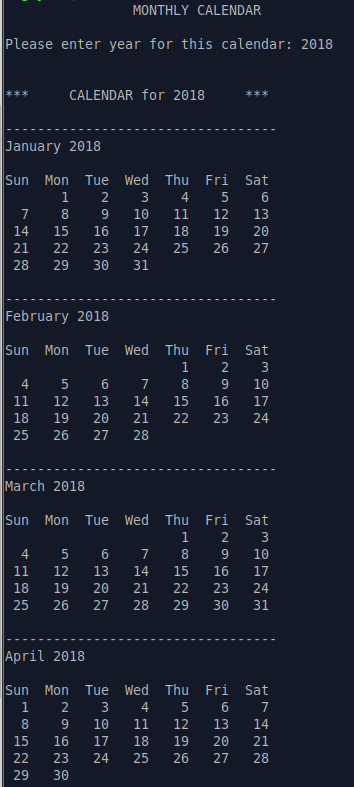|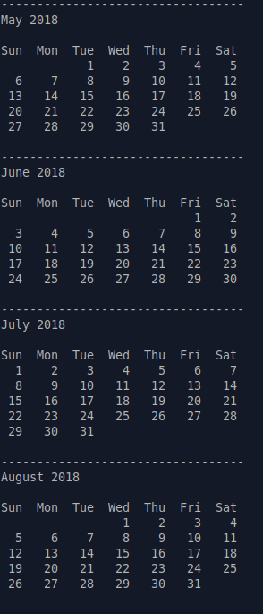|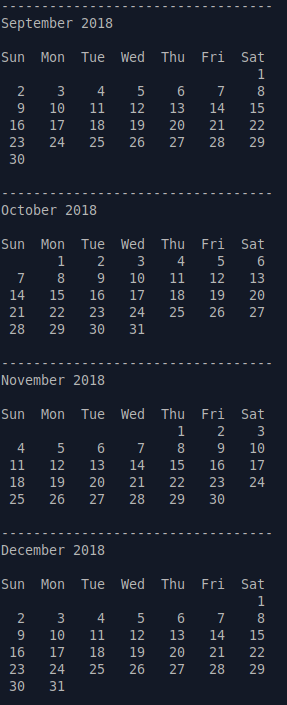

## Game Of Life
### Description
This CLI (Command Line Interface) program will allow the user to simulate John Conway's Game of Life on the console / command line interface (ex: BASH), within the grid that is customized by the user.

[Learn More](https://github.com/tdn90/CS2303-System-Programming/tree/master/assignment2)

[Online Demo](https://bitstorm.org/gameoflife/) to compare result

### Sample output: 
Run with: 
    `./life 10 10 10 blinker.txt y y`

|  First stage   |   Second state       |  Third (final) stage    |
|:--------------:|:---------------:|:---------------:|
|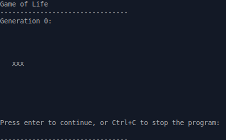|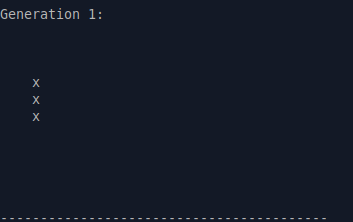|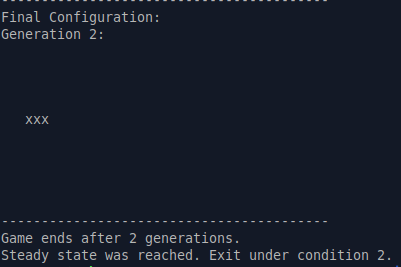

## String Library Functions implementation
### Functions implemented
1. size_t mystrlen1(const char* s);
2. size_t mystrlen2(const char* s);
3. char* mystrdup1(const char* src);
4. char* mystrdup2(const char* src);
5. char *mystrcpy(char *dest, const char *src);
6. char *mystrcat(char *dest, const char *src);
7. char *mystrncat(char *dest, const char *src, size_t n);
8. char *mystrncpy(char *dest, const char *src, size_t n);
9. char *mystrndup(const char *s, size_t n);

[Learn More](https://github.com/tdn90/CS2303-System-Programming/tree/master/PA3A_tnguyen4)

## Employee Structure Implementation
### Description
Implement and test functions related to a newly created Employee struct in C.

### Functions implemented for Employee struct:
1. struct Employee makeEmployee(int birth, int start, const char name);
2. void printEmployee(struct Employee *e);
3. struct Employee* makeRandEmployee();
4. int randInt(int max);
5. char *randStr();
6. char randLowercase();
7. char randUppercase();
8. struct Employee **getRandListEmployee(int size);
9. void printEmployees(struct Employee **list, int count);
10. void freeArray(struct Employee **list, size_t count);
11. struct Employee **shallowCopy(struct Employee **list, int size);
12. struct Employee *deepCopyEmp(struct Employee *e);
13. struct Employee **deepCopyList(struct Employee **list, size_t size);

[Learn More](https://github.com/tdn90/CS2303-System-Programming/tree/master/PA3B_tnguyen4)

## Predator-prey simulation
### Description
Implement a simple 2D predator-prey simulation using derived classes and virtual functions in C++.

[Learn More](https://github.com/tdn90/CS2303-System-Programming/tree/master/PA4_tnguyen4)

### Sample output: 
Run with: 
    `./PA4 20 200 200 20 2 1`

|                |                 |
|:--------------:|:---------------:|
|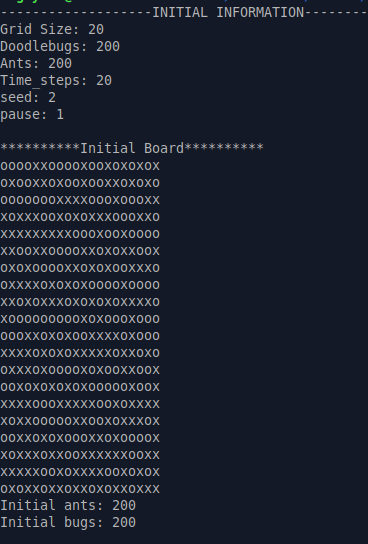|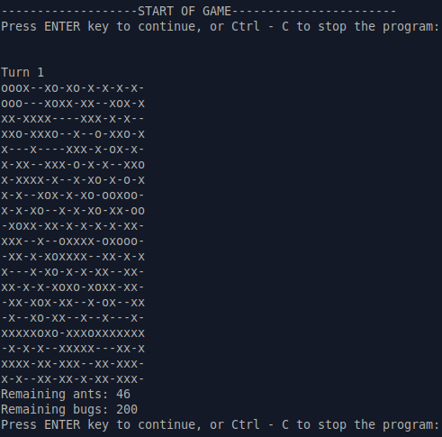|
|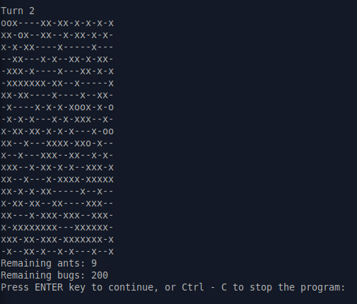|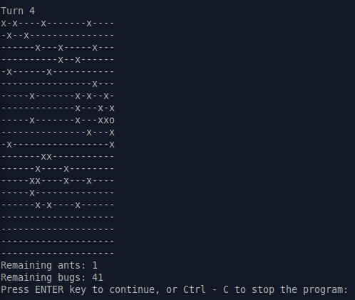|
|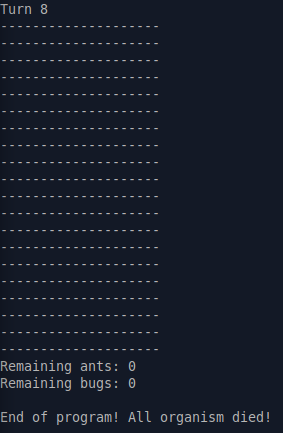|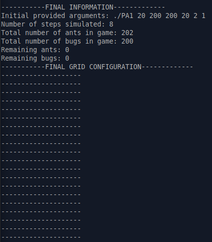|

## Event Driven Simulation
### Description
An event-driven simulation is a computer program that mimics the behavior of people or objects in a system in response to events that occur at certain times.

Specifically, this program will simulate a simply, daily activity of people in a Bank.

The major activities that we are tracking are:

1. For customers:
    - Customer arrival.
    - Customer leaving bank.
2. For Bank tellers:
    - Teller's service for one customer.
    - Teller's completion of service.
    - Teller's break.

[Learn More](https://github.com/tdn90/CS2303-System-Programming/tree/master/PA5_tnguyen4)

### Purpose
1. Measure the average amount of time people spend between arriving at the bank and leaving the bank.
2. Compare the efficiency between two possible bank setup:
    - One customer line for each teller.
    - One common line for all tellers.
